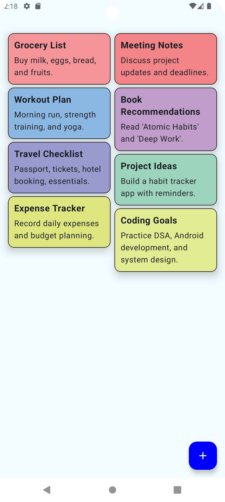
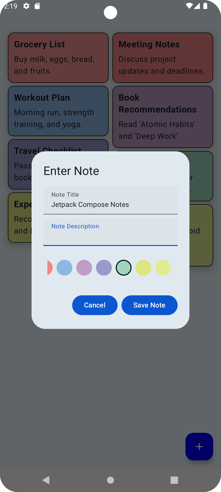
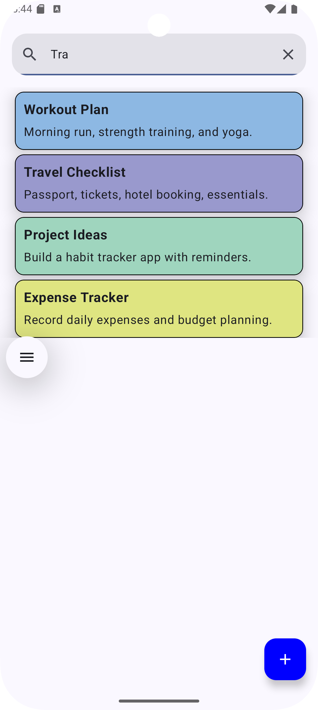

# NoteStack

A simple and efficient notes-taking application built using **Jetpack Compose** and **Room Database**, designed for quick and organized note management.

## Features
- **Jetpack Compose UI** – Modern, responsive, and smooth UI.
- **Room Database** – Stores notes locally for offline access.
- **CRUD Operations** – Create, Read, Update, and Delete notes.
- **State Management** – Utilizes ViewModel, LiveData, and StateFlow for efficient UI updates.
- **Search Functionality** – Real-time note filtering using Room queries.
- **Theming & UI Customization** – Supports dark mode and dynamic styling.

## Tech Stack
- **Language:** Kotlin
- **UI:** Jetpack Compose
- **Architecture:** MVVM (Model-View-ViewModel)
- **Database:** Room Database
- **State Management:** ViewModel, LiveData, StateFlow

  
  
  

 

## Future Improvements
- Cloud Sync with Firebase
- Reminder Notifications
- Rich Text Formatting
